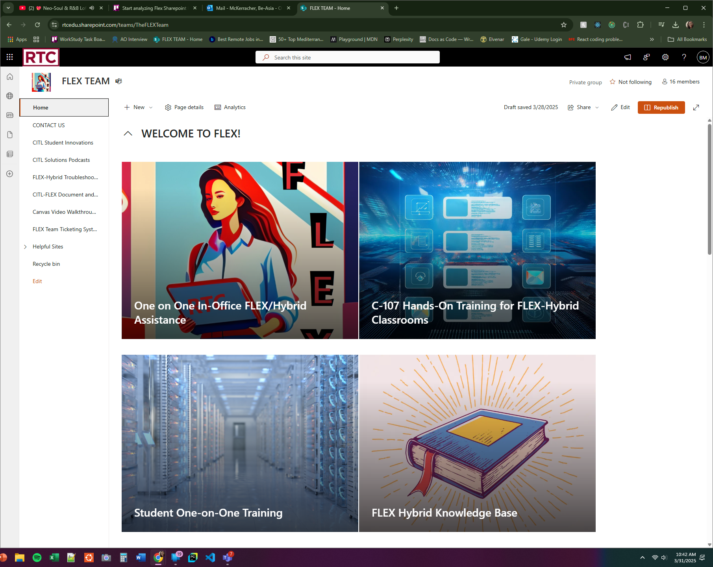
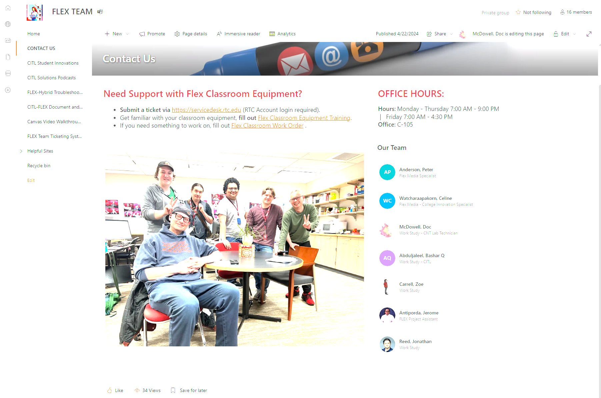
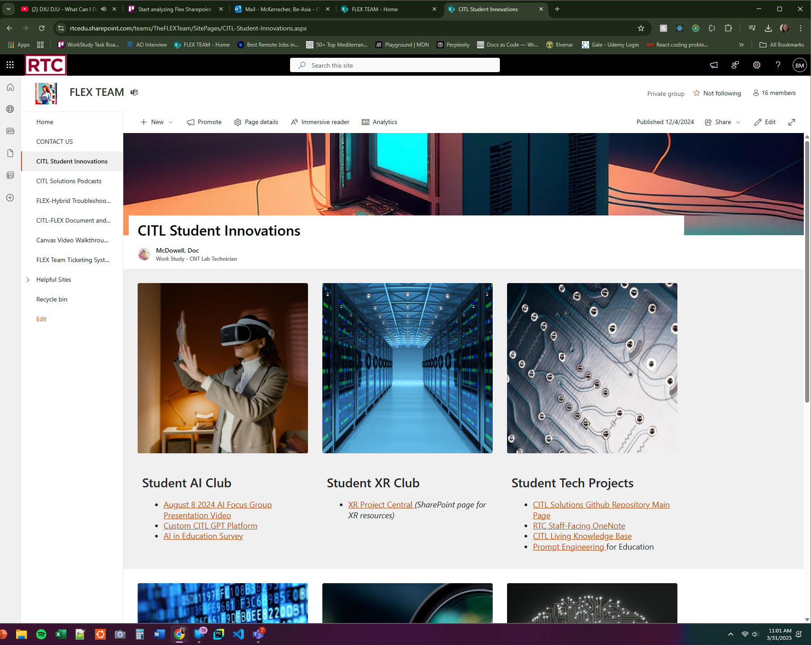

 

<h1>Flex SharePoint Site Findings</h1> 

Prepared by: Be-Asia McKerracher 3/31/2025

 
 

#### 1. Overview

This document outlines the findings based on careful review of the Flex Team Sharepoint site.  The goal of this document is to provide details to the team about aspects of the site that are both aesthetically pleasing and functional, while also focusing on possible areas of growth/updating for the site.  

 

#### 2. Findings

 
 

  

    
    
Fig. 1: Image of main page (with analytics)

  

   
  
  

    
    
Fig. 2: Image of main page

  

 

##### 2.1 Areas Of Strength

 

While the site is in need of updating, the site itself is functional and being used according to its stated purpose.  There are approximately 16 people who currently have access to the site.  Analytics show usage of the last 90 days, though it is small in comparison to desired goals. A few items to note:

1. All links on the side panel are functioning properly and either open to a new tab or open in the same window. The image above shows 8 links including the home link and all are functional. All links in the helpful sites are also working.
2. Each card on the main page is aesthetically pleasing for clients and is working as expected, opening to either training or appointment setups.
3. The video at the bottom, which focuses on teaching in Flex mode, is opening and working properly.

 

##### 2.2 Standout Areas of High Success

 

  

    
    
Fig. 3: Contact Us page

  

  

  

    The Contact Us page is extremely well developed:
    
    1. Eye-catching banner image
    2. Well organized information and well-placed links
    3. Central image of the team
  

  

 

Fig. 4: Student Innovation page

