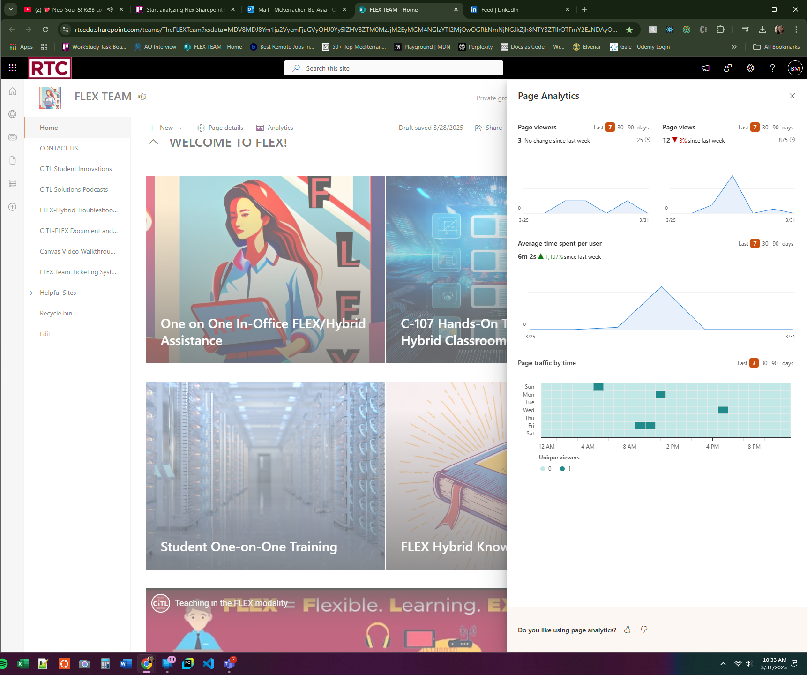

 

<h1>Flex SharePoint Site Findings</h1> 

Prepared by: Be-Asia McKerracher 3/31/2025

 

##### Overview

This document outlines the findings based on careful review of the Flex Team Sharepoint site.  The goal of this document is to provide details to the team about aspects of the site that are both aesthetically pleasing and functional, while also focusing on possible areas of growth/updating for the site.  

 
 

##### Areas of Strength

{width=250 height=250}

Fig. 1: Image of main page (with analytics)

